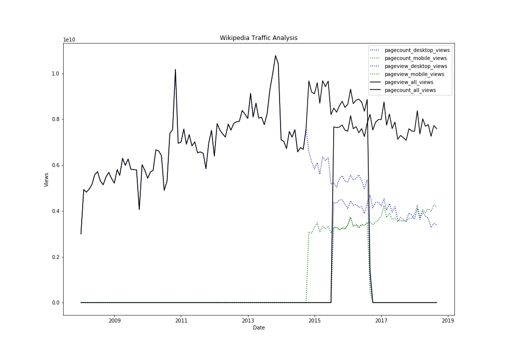

## Data512-HCDS-A1

The goal of this project is to construct, analyze, and publish a dataset of monthly traffic on English Wikipedia from January 1 2008 through September 30 2018, following the best practices for open scientific research and reproducibility.

### Data sources

All of the raw data used in the code is from the __[Pagecounts](https://wikitech.wikimedia.org/wiki/Analytics/AQS/Legacy_Pagecounts)__ 
and __[Pageviews](https://wikitech.wikimedia.org/wiki/Analytics/AQS/Pageviews)__ APIs. The raw responses of these API calls are stored in the `data-raw` folder and the transformed data is located in the `data-cleaned` folder

NOTE: Data from the Pageview API excludes spiders/crawlers, while data from the Pagecounts API does not.
The licence and terms of use for the REST API are located at https://www.mediawiki.org/wiki/REST_API#Terms_and_conditions.

### Data transformations

The page counts/views are collected for the following channels: 
 - pagecounts_desktop-site
 - pagecounts_mobile-site
 - pageviews_mobile-web
 - pageviews_mobile-app
 - pageviews_desktop
 
These 5 datasets are then combined into a single table with the following transformations:
 - For data collected from the Pageviews API, combine the monthly values for mobile-app and mobile-web to create a total mobile traffic count for each month.
 - For all data, separate the value of timestamp into four-digit year and two-digit month and discard values for day and hour.
 
The final table has the following fields: (all numeric)
'pagecount_desktop_views'
'pagecount_mobile_views'
'pageview_desktop_views'
'pageview_mobile_views'
'pageview_all_views'
'pagecount_all_views'
'year'
'month'

### Python and Library versions

- Python: 3.6.2
- requests: 2.18.4
- json: 2.6.0
- pandas: 0.22.0
- matplotlib: 2.0.2

### Results

